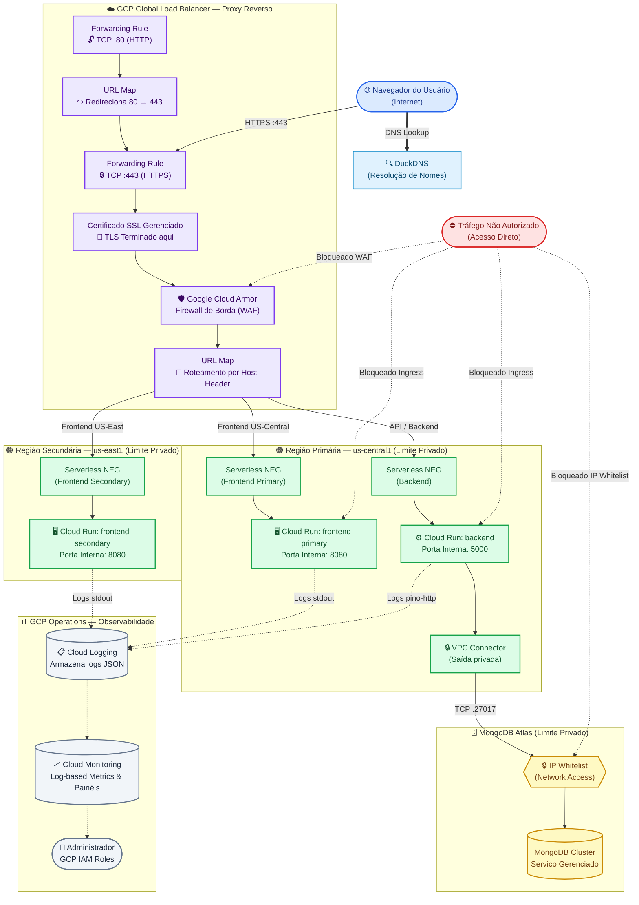

# Diagrama da Arquitetura

O diagrama abaixo representa a infraestrutura implementada no Google Cloud Platform para o desafio, atendendo a todos os requisitos de segurança, redundância e comunicação exigidos.

## Resumo dos Controles de Acesso

| Componente | Regra de Acesso | Fluxos Permitidos | Fluxos Bloqueados |
|------------|-----------------|-------------------|-------------------|
| **Load Balancer** | Exposto à internet na porta 443 | `Usuário → Load Balancer` (HTTPS) | Tráfego HTTP não seguro (porta 80) e portas diferentes da 443 |
| **Front-end** | Bloqueado da internet (Ingress Restrito) | `Load Balancer → Front-end` | `Internet → Front-end` (Acesso direto) |
| **Back-end** | Bloqueado da internet (Ingress Restrito) | `Load Balancer → Back-end` | `Internet → Back-end` (Acesso direto) |
| **Cloud Armor** | Firewall de Borda | Tráfego web limpo | Ataques conhecidos, DDoS e IPs maliciosos |
| **MongoDB Atlas**| Firewall de Rede | `Back-end (VPC) → Atlas` (TCP 27017) | `Internet → Atlas` |
| **GCP Console**| Controle via IAM | `Admin → Cloud Monitoring` | Acessos não autenticados / sem permissão na GCP |
