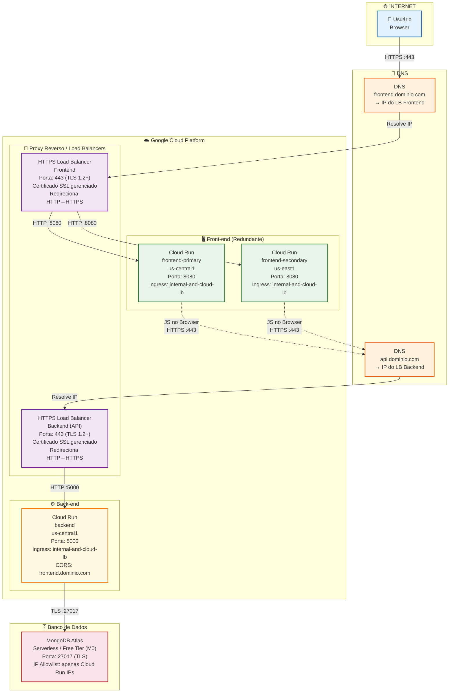
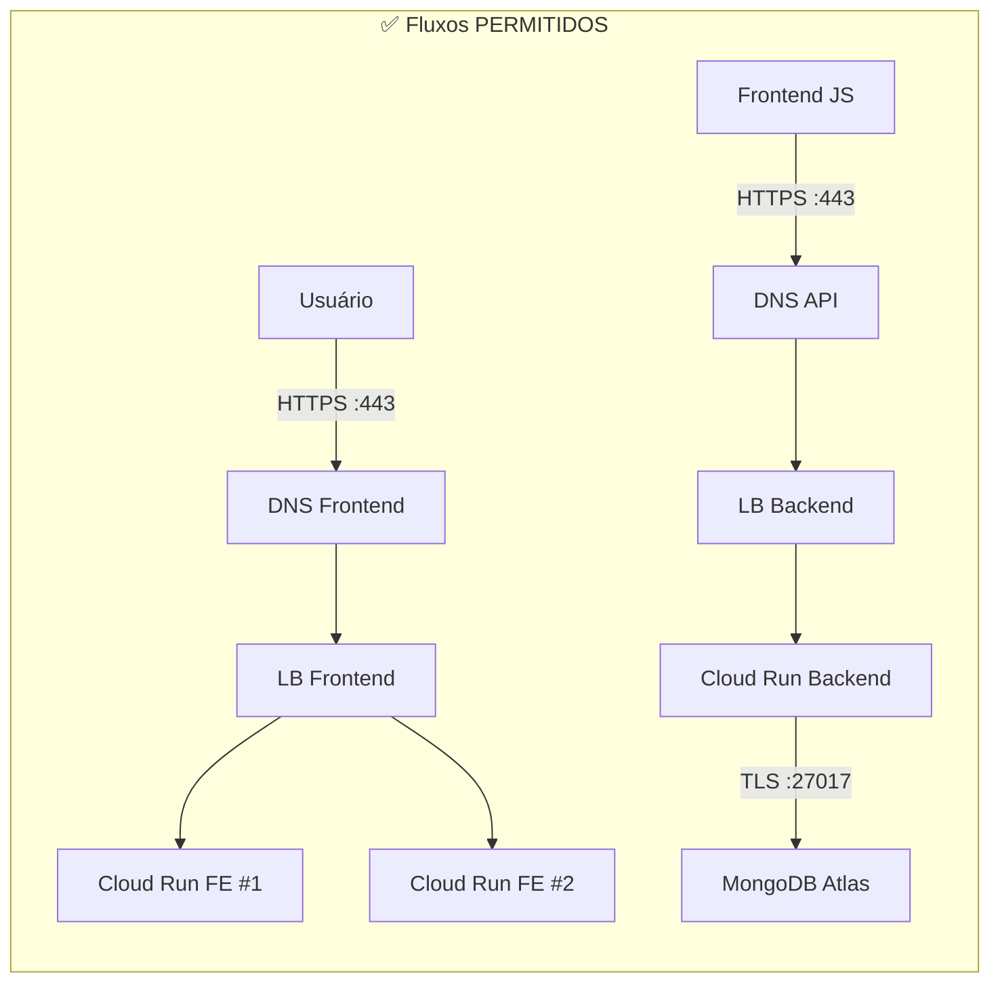
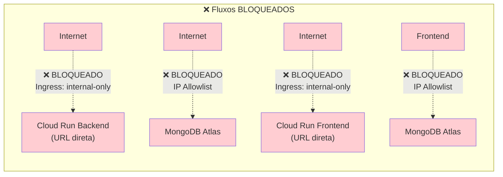
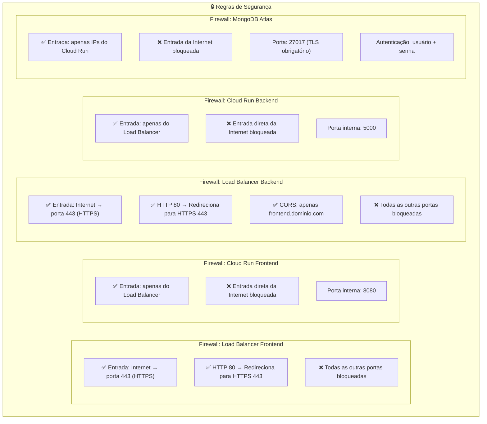
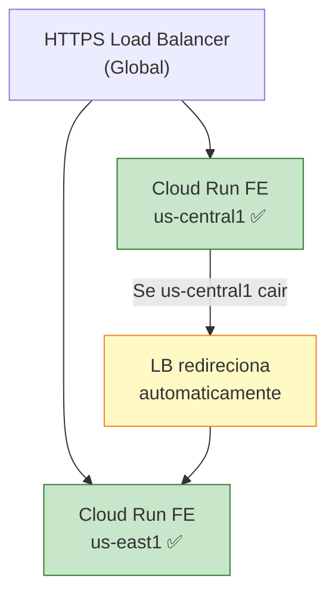
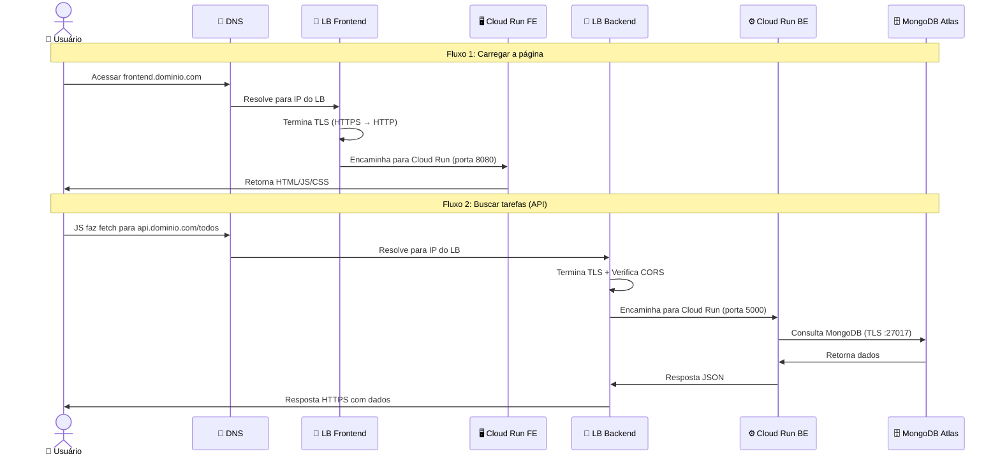

# Diagrama de Arquitetura — Infraestrutura Serverless GCP

## Visão Geral da Arquitetura

---

## Diagrama de Fluxos Permitidos e Bloqueados

---

## Detalhamento de Segurança por Componente

---

## Redundância do Front-end

---

## Tabela de Portas e Protocolos

| Origem | Destino | Porta | Protocolo | Status |
|--------|---------|-------|-----------|--------|
| Usuário (Internet) | LB Frontend | 443 | HTTPS/TLS 1.2+ | ✅ Permitido |
| Usuário (Internet) | LB Frontend | 80 | HTTP | 🔄 Redireciona p/ 443 |
| LB Frontend | Cloud Run FE #1 | 8080 | HTTP (interno) | ✅ Permitido |
| LB Frontend | Cloud Run FE #2 | 8080 | HTTP (interno) | ✅ Permitido |
| Frontend JS (Browser) | LB Backend | 443 | HTTPS/TLS 1.2+ | ✅ Permitido |
| LB Backend | Cloud Run Backend | 5000 | HTTP (interno) | ✅ Permitido |
| Cloud Run Backend | MongoDB Atlas | 27017 | TLS | ✅ Permitido |
| Internet | Cloud Run FE (direto) | * | * | ❌ Bloqueado |
| Internet | Cloud Run BE (direto) | * | * | ❌ Bloqueado |
| Internet | MongoDB Atlas | 27017 | * | ❌ Bloqueado |
| Frontend | MongoDB Atlas | 27017 | * | ❌ Bloqueado |

---

## Fluxo Completo de uma Requisição

